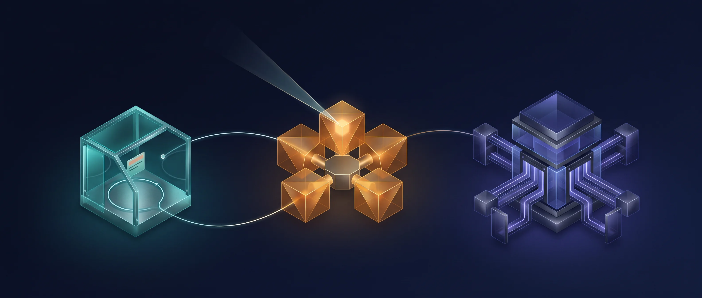
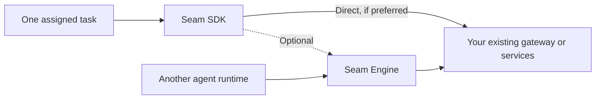
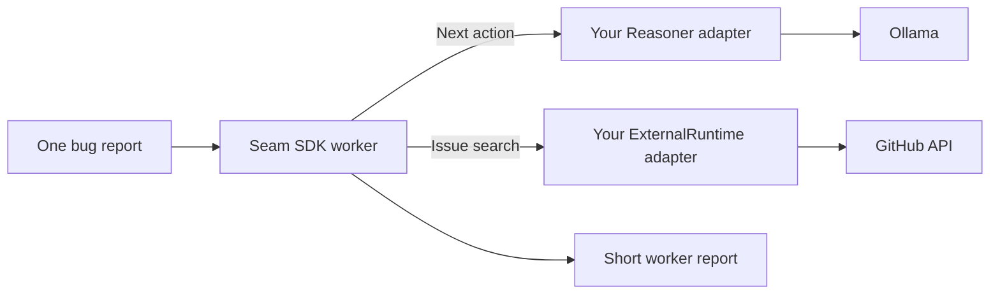
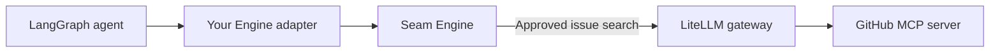
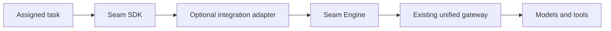

# Seam



**Give a worker one job. Decide what it may use. Let your existing infrastructure do the work.**

Seam is a modular architecture for task-scoped AI workers and semantic decision routing. It has two independent implementation projects:

| Project | In everyday terms | What it handles |
| --- | --- | --- |
| [Seam SDK](https://github.com/Judge-M/Seam-SDK) | A small worker with a clear assignment | Its task, local work, step limit, observations, and final report |
| [Seam Engine](https://github.com/Judge-M/Seam-Engine) | A permission-aware dispatcher | Which approved kind of model or tool operation fits an intent |
| Your existing gateway | The execution layer you already trust | The actual model, tool, MCP server, provider, and credentials |

Think of a worker asked to investigate one failing test. The **SDK** keeps that job bounded. If the worker needs an issue search, the **Engine** can decide whether issue search is allowed and select that semantic capability. Your **gateway** then chooses the actual service that performs the search.



The two implementation repositories have no core dependency on each other. Use either one alone or combine them through an adapter.

## Pick the piece you need

| If you want to... | Start with... |
| --- | --- |
| Run a small worker against one task and get a bounded report | [Seam SDK](https://github.com/Judge-M/Seam-SDK) |
| Add authority checks and semantic routing to an existing agent | [Seam Engine](https://github.com/Judge-M/Seam-Engine) |
| Do both while keeping your current gateway | [The optional combined example](examples/combined) |

## Example setups

These show **possible integrations**, not built-in connectors. The repositories include standalone fixtures and an SDK–Engine adapter example. Connecting a named product below requires an adapter and your own configuration.

### 1. A focused coding worker with local inference

Give [Seam SDK](https://github.com/Judge-M/Seam-SDK) a ticket such as “inspect this failing test and summarize the likely cause.” A custom `Reasoner` adapter could ask [Ollama](https://docs.ollama.com/api/openai-compatibility) for the next action. A separate `ExternalRuntime` adapter could search issues through the [GitHub API](https://docs.github.com/en/rest/issues/issues). The SDK keeps the worker's task and local observations bounded.



### 2. An existing agent with an approval-aware route

A [LangGraph](https://docs.langchain.com/oss/python/langgraph/workflows-agents) application could call Seam Engine through a service or adapter. Engine checks a trusted grant before selecting a capability such as `development.issue.search`. A gateway such as [LiteLLM](https://docs.litellm.ai/docs/) could map that route to a [GitHub MCP server](https://github.com/github/github-mcp-server). LangGraph remains the agent runtime; LiteLLM remains the gateway.



### 3. A bounded worker with semantic routing

Use both projects when a task-scoped worker should pass external requests through a decision plane. The [combined fixture](examples/combined) demonstrates this boundary with no live gateway or credentials. In a deployment, an adapter could connect Engine to an existing gateway such as LiteLLM.



## Try the examples

Clone the three repositories as sibling directories to run the combined fixture:

```sh
git clone https://github.com/Judge-M/Seam.git
git clone https://github.com/Judge-M/Seam-SDK.git
git clone https://github.com/Judge-M/Seam-Engine.git
cargo run --manifest-path Seam/examples/combined/Cargo.toml
```

The fixture returns `Fixture issue inspected`. For a single product, each implementation repo also has a standalone example that needs no external credentials.

## The boundary in one minute

- **SDK:** “What do I need done next for this one task?” It owns the worker loop, local workbench, and report.
- **Engine:** “Which sanctioned semantic capability fits this intent?” It checks trusted authority before routing.
- **Gateway:** “Which actual model, tool, or provider performs it?” It owns execution, credentials, MCP connectivity, and infrastructure fallback.

Engine does not replace a gateway, and SDK does not require Engine. [Read the architecture](docs/ARCHITECTURE.md), [design principles](docs/DESIGN_PRINCIPLES.md), [trust boundaries](docs/SECURITY.md), [terminology](docs/TERMINOLOGY.md), and [migration guide](docs/MIGRATION.md).

Licensed under Apache-2.0. See [LICENSE](LICENSE).
